# Flow

This document describes how the flow of data works from the database, to a view, to the API, to the front end.

_Note for this diagram to render correctly, you must have the mermaid extension installed in your markdown viewer._

This diagram may not render well in VSCode. You may prefer to view it online from the [mermaid live editor](https://mermaid-js.github.io/mermaid-live-editor/). Copy the code below into the live viewer.

```mermaid

classDiagram
    class DB Account{
        Username
        PasswordHash
        UserId
    }

    class DB Character{
        CharId
        CharName
        UserId
        WeaponId
    }

    class DB Weapon{
        WeaponId
        WeaponName
        WeaponDesc
        ImageURL
        ObtainMethod
        StatAttack
    }

    class DB Unlocks Weapon{
        WeaponId
        AdvancementId
    }

    class DB Completes{
        CharId
        AdvancementId
    }

    class DB Advancement{
        Name
        AdvancementId
    }

    class DB Equips{
        CharId
        AccessoryId
    }

    class DB Accessory{
        AccessoryId
        AccessoryName
        AccessoryDesc
        StatBonus
        ObtainMethod
        ImageURL
    }

    class DB UnlocksAccessory{
        AccessoryId
        AdvancementId
    }

    class DB Wears{
        CharId
        ArmorId
    }

    class DB Armor{
        ArmorId
        ArmorName
        ArmorDesc
        ImageURL
        StatDefense
        ObtainMethod
        ArmorSlot
        StatBonus
    }

    class DB UnlocksArmor{
        ArmorId
        AdvancementId
    }

    class DB UserSession{
        UserId
        Token
    }



    style DBAccount fill:#800,color:#FFF
    style DBCharacter fill:#800,color:#FFF
    style DBWeapon fill:#800,color:#FFF
    style DBUnlocksWeapon fill:#800,color:#FFF
    style DBCompletes fill:#800,color:#FFF
    style DBAdvancement fill:#800,color:#FFF
    style DBEquips fill:#800,color:#FFF
    style DBAccessory fill:#800,color:#FFF
    style DBUnlocksAccessory fill:#800,color:#FFF
    style DBWears fill:#800,color:#FFF
    style DBArmor fill:#800,color:#FFF
    style DBUnlocksArmor fill:#800,color:#FFF
    style DBUserSession fill:#800,color:#FFF




    DB Character --> VIEW Users Characters
    DB Weapon --> VIEW Character Equipment
    DB Accessory --> VIEW Character Equipment
    DB Armor --> VIEW Character Equipment




    class VIEW Users Characters{
        List of User's Character Names + ID's
    }

    class VIEW Character Equipment{
        List of Armor Names + ID's
        Weapon Name + ID
        List of Accessory Names + ID's
    }

    style VIEWUsersCharacters fill:#880,color:#FFF
    style VIEWCharacterEquipment fill:#880,color:#FFF


    VIEW Users Characters --> API GET Account
    VIEW Character Equipment --> API GET Character




    DB Account --> API GET Account
    VIEW Users Characters --> API GET Account
    DB Character --> API GET Character
    VIEW Character Equipment --> API GET Character
    DB Weapon --> API GET Character
    DB Accessory --> API GET Character
    DB Armor --> API GET Character
    DB Weapon --> API GET Items
    DB Accessory --> API GET Items
    DB Armor --> API GET Items
    DB Weapon --> API GET Item Detail
    DB Accessory --> API GET Item Detail
    DB Armor --> API GET Item Detail

    DB Character --> API DELETE Character
    DB Character --> API POST Character
    DB Account --> API PUT Account
    DB Account --> API DELETE Account
    DB UserSession --> API DELETE Login
    DB Wears --> API DELETE Equipment
    DB Equips --> API DELETE Equipment
    DB Character --> API DELETE Equipment
    DB Wears --> API POST Equipment
    DB Equips --> API POST Equipment
    DB Character --> API POST Equipment
    DB UserSession --> API POST Login
    DB Account --> API POST Account
    DB Account --> API POST Reset Password
    DB UnlocksAccessory --> API GET Item Detail
    DB UnlocksAccessory --> API GET Items
    DB UnlocksArmor --> API GET Item Detail
    DB UnlocksArmor --> API GET Items
    DB Unlocks Weapon --> API GET Item Detail
    DB Unlocks Weapon --> API GET Items
    DB Advancement --> API GET Advancements




    class API GET Account{
        Username
        UserId
        List of Characters Names + ID's
    }

    class API GET Character{
        Name
        List of Armor Names + ID's
        Weapon Name + ID
        List of Accessory Names + ID's
        Statistics
    }

    class API GET Items{
        List of Filtered Items Names + ID's + ImageURL's
    }

    class API GET Item Detail{
        Item Name
        Item Description
        Image URL
        Item Type
        Stat Bonus
        Obtain Method
        Required Advancements
    }




    class API DELETE Character{
        Delete Character(Character ID)
    }

    class API POST Character{
        Add Character(Character Name)
    }

    class API PUT Account{
        Change Password(Old Password, New Password)
        Change Username(New Username)
    }

    class API DELETE Account{
        Delete Account()
    }

    class API DELETE Login{
        Logout()
    }

    class API DELETE Equipment{
        Unequip Item(CharacterId, Item Type, Item Id)
    }

    class API POST Equipment{
        Equip Item(CharacterId, Item Type, Item Id)
    }

    class API POST Login{
        Login(Username, Password)
    }

    class API POST Account{
        Register(Username, Password)
    }

    class API POST Reset Password{
        Reset Password(Username)
    }

    class API GET Advancements{
        List of Advancements
    }



    style APIGETAccount fill:#080,color:#FFF
    style APIGETCharacter fill:#080,color:#FFF
    style APIGETItems fill:#080,color:#FFF
    style APIGETItemDetail fill:#080,color:#FFF
    style APIDELETECharacter fill:#080,color:#FFF
    style APIPOSTCharacter fill:#080,color:#FFF
    style APIPUTAccount fill:#080,color:#FFF
    style APIDELETEAccount fill:#080,color:#FFF
    style APIDELETELogin fill:#080,color:#FFF
    style APIDELETEEquipment fill:#080,color:#FFF
    style APIPOSTEquipment fill:#080,color:#FFF
    style APIPOSTLogin fill:#080,color:#FFF
    style APIPOSTAccount fill:#080,color:#FFF
    style APIPOSTResetPassword fill:#080,color:#FFF
    style APIGETAdvancements fill:#080,color:#FFF




    API GET Account --> Frontend Account
    API GET Character --> Frontend Character
    API GET Items --> Frontend Home
    API GET Item Detail --> Frontend Item Detail
    API GET Advancements --> Frontend Home

    API DELETE Character --> Frontend Account
    API POST Character --> Frontend Account
    API PUT Account --> Frontend Account
    API DELETE Account --> Frontend Account
    API DELETE Login --> Frontend Account
    API DELETE Equipment --> Frontend Character
    API DELETE Login --> Frontend Character
    API POST Equipment --> Frontend Home
    API DELETE Login --> Frontend Home
    API POST Equipment --> Frontend Item Detail
    API DELETE Login --> Frontend Item Detail
    API POST Login --> Frontend Login
    API POST Account --> Frontend Login
    API POST Reset Password --> Frontend Login





    class Frontend Account{
        Get Account - Username(Token)
        Get Account - List of Characters Names + ID's(Token)
        Delete Character(Token, Character ID)
        Post Character - Add Character(Token, Character Name)
        Put Account - Change Password(Token, Old Password, New Password)
        Put Account - Change Username(Token, New Username)
        Delete Account - Delete Account(Token)
        Delete Login - Logout(Token)
    }

    class Frontend Character{
        Get Character - Name(Token, Character ID)
        Get Character - List of Armor Names + ID's(Token, Character ID)
        Get Character - Weapon Name + ID(Token, Character ID)
        Get Character - List of Accessory Names + ID's(Token, Character ID)
        Get Character - Statistics(Token, Character ID)
        Delete Equipment - Unequip Item(Token, Character ID, Item Type, Item ID)
        Delete Login - Logout(Token)
    }

    class Frontend Home{
        Get Items - List of Filtered Items Names + ID's + ImageURL's(Token, Filters JSON)
        Get Advancements - List of Advancements(Token)
        Post Equipment - Equip Item(Token, CharacterId, Item Type, Item Id)
        Delete Login - Logout(Token)
    }

    class Frontend Item Detail{
        Get Item - Item Name
        Get Item - Item Description
        Get Item - Image URL
        Get Item - Item Type
        Get Item - Stat Bonus
        Get Item - Obtain Method
        Get Item - Required Advancements
        Post Equipment - Equip Item(Token, Item Type, Item ID)
        Delete Login - Logout(Token)
    }

    class Frontend Login{
        Post Login(Username, Password)
        Post Account - Register(Username, Password)
        Post Reset Password(Username)
    }

    style FrontendAccount fill:#008,color:#FFF
    style FrontendCharacter fill:#008,color:#FFF
    style FrontendHome fill:#008,color:#FFF
    style FrontendItemDetail fill:#008,color:#FFF
    style FrontendLogin fill:#008,color:#FFF
```

