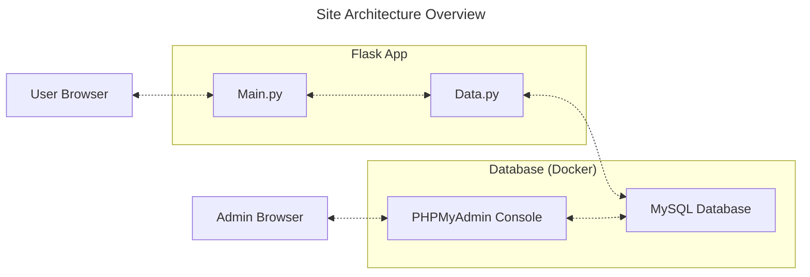

```bash
sudo apt install python3.10-venv
python3 -m venv .venv # Create a virtual environment
source ./venv/bin/activate
pip install -r requirements
```

- [X] Remove the following fields:
    - ObtainMethod
    - WeaponDescription
- [X] Add the following fields:
    - DamageType

