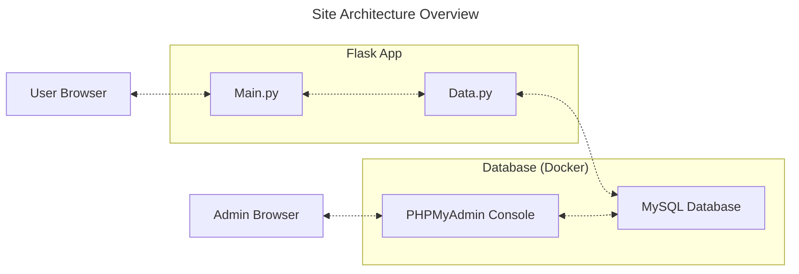

```bash
sudo apt install python3.10-venv
python3 -m venv .venv # Create a virtual environment
source ./venv/bin/activate
pip install -r requirements
```

- [X] Remove the following fields:
    - ObtainMethod
    - WeaponDescription
- [X] Add the following fields:
    - DamageType


Changes to make to the Report 6 document:
- [x] Update "App Requirements" to match what we actually did (remove wishlist items)
- [x] Update the diagram pictures
- [x] Update the list of relational schema types
- [x] Fill in the "API Documentation" by describing the `data.py` document (and updating the code comments/documentation)
- [x] Fill in the "Frontend Documentation" by describing the different endpoints provided by the site, and refer to the `main.py` file.
- [x] Make a basic diagram showing how our design works.
- [ ] Did we ever enforce the rule "usernames can have letters and numbers, but no special characters"?
- [ ] Ask about the "Data for pages or something (jordan)" section. Section title should be renamed. I also have no idea what the content is supposed to be.

